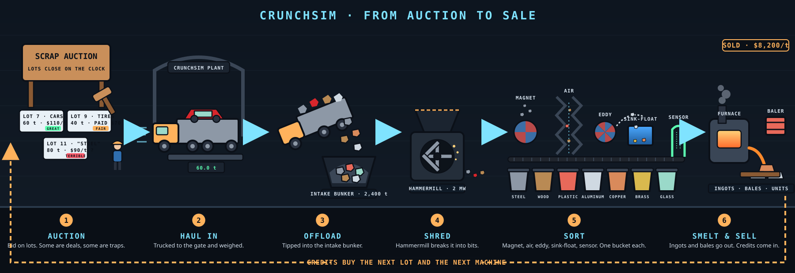

# CrunchSim

A simulator game of how industry crunches stuff into bits, played as a plant-building score game.

Feed a mix of materials into a line of real industrial machines, run a batch, and watch what happens in a cross-section "machine cam" while mission-control telemetry reports particle size, reduction ratio, energy, power, wear and product value. Grinding earns credits into your bank. The bank buys machines and upgrades. Your score is your net worth.

## The game loop



- **Start small.** You own a hammermill shredder and $2,800. The starter line shreds end-of-life vehicles into mixed shred, which sells at a discount because nothing is sorted. Two or three batches pay for your first sorter. The bank panel's NEXT PURCHASE block ranks the unowned sorters by the margin each would add to the end of your line, and you unlock them one at a time: sink-float tank, magnetic drum, air classifier, eddy current separator, then the screen.
- **Run batches.** Each batch buys feed, pays for power and consumables, and sells the product bins. The net lands in your bank on a score card at the end of the run.
- **Buy and upgrade.** Twenty-five more machines can be bought from the flowsheet panel. Each machine type can be raised five levels for more capacity, efficiency, liner life and power. Plant upgrades raise the batch size, cut the power price, lift product prices and cut liquid nitrogen cost. Supplier contracts unlock richer feeds such as tires, zorba and quarry rubble. The Facility & office panel sells a trading desk, a sampling lab, a control room, a weighbridge, a maintenance bay, a power substation, dust and water treatment and a nitrogen tank farm; the site drawing fills in as you buy them.
- **Take contracts.** Clients post jobs with a spec sheet: target material, purity, recovery, a size window and an energy cap. They supply the feed. Bins that meet the spec ship, stars decide the fee, and every job hides a machine that looks right but is wrong for that material.
- **Rank up.** Net worth is bank plus everything you own. It moves you from Scrapyard through Recycler, Processor, Plant operator and Industrial group to Mega-plant.

Preset lines act as blueprints: loading one you cannot afford shows what to buy. Progress is saved in your browser; New Game in the bank panel wipes it.

## What it simulates

**Materials:** steel, cast iron, aluminum, copper, brass, pot metal (zinc die-cast), wood, rubber, plastic, glass, granite, limestone, hydrogel and water. Each has density, a Bond work index (published values for the rocks, calibrated for the rest), ductility, conductivity, magnetism, abrasiveness and a response profile to each breaking mechanism at ambient, freezer and cryogenic temperature.

**Machines (26):**

| Family | Machines |
| --- | --- |
| Compression | Jaw crusher, cone crusher, roll crusher, high-pressure grinding rolls |
| Impact and shredding | Vertical shaft impactor, hammermill shredder, tub grinder, twin-shaft shear shredder, single-shaft shredder, granulator, drum chipper |
| Fine and cold | Ball mill, cryogenic mill, blast freezer |
| Hydraulic shear | Colloid mill, high-pressure homogenizer, high-pressure atomizer |
| Separation | Magnetic drum, eddy current separator, zig-zag air classifier, vibrating screen, sink-float tank, sensor sorter (XRT / LIBS) |
| Smelting | Induction furnace, electric arc furnace, reverberatory kiln |

**Physics in the numbers:**

- Particle size distributions are Rosin-Rammler curves over 24 log-spaced size bins from 1 µm to 1 m.
- Comminution energy follows Bond's law, `E = 10 · Wi · (1/√P80 − 1/√F80)` kWh/t, divided by machine efficiency and by how well the machine's mechanism mix (compression, impact, shear, attrition, cutting, hydraulic shear) breaks that material.
- Brittle solids fracture under compression and impact. Ductile metals bend and need shear or cutting. Wood is cut or hammered. Rubber bounces unless chilled below its glass transition. Gel is sheared through micron gaps. Water cannot be crushed: freeze it and crush the ice, or atomize it.
- Separators apply partition curves: magnetic recovery, eddy-current force from conductivity over density, terminal velocity in air, screen aperture, float-sink by density, and a sensor sorter that recognises one chosen material on 10 to 150 mm pieces.
- Furnaces melt the metals they are built for into one bath cast as ingots: energy is the handbook melt enthalpy plus superheat divided by thermal efficiency (about 600 kWh/t for aluminum in an induction furnace, 450 kWh/t for steel in an arc furnace), oxidation to dross grows with superheat and with fines, and an ingot sells on the purity of the melt, so mixed metal makes worthless alloy soup.
- Each machine has capacity and rated power, so the slowest or most power-limited node sets the head feed rate. Wear accrues with abrasiveness, and worn machines lose efficiency until serviced.

## Play

Open `index.html` in a browser. There is no build step and no dependency. To serve it:

```bash
python -m http.server 8000
```

Then browse to <http://localhost:8000>. On GitHub, enable Pages (Settings → Pages → deploy from the `main` branch, root folder) to host it.

**Controls:** Space runs or stops a batch, 1/2/3 sets simulation speed, M toggles sound, ? opens help. Click a flowsheet node to see it in the cam and edit its settings. Click a material name for its properties. Progress is saved in your browser.

**Plant floor in 3D:** `plant3d.html` lays a flowsheet out as a plant hall: an intake hopper that swallows a car, chair, tire or rock depending on the feed, labelled machine blocks along striped conveyors, and bins that fill with the sim's steady-state product masses. Fragments shrink at crushers and are routed at separators with the same partition curves the game uses, so moving a settings slider changes the traffic at once. Pick a preset feed and line or press "use my plant" to load the line saved by the game. It loads three.js r128 from cdnjs; drag to orbit, wheel to zoom, right-drag to pan.

## Project layout

```
index.html        page shell
css/style.css     mission-control theme
js/data.js        materials, machines, preset feeds and lines, prices, upgrades, ranks, sources
js/sim.js         physics core (no DOM): size distributions, Bond energy, breakage, separation, flowsheet evaluation
js/cam.js         animated machine cam engine and particle system
js/scenes-a.js    cam scenes: compression, rotor, shear, cutting, tumbling machines
js/scenes-b.js    cam scenes: hydraulic machines, freezer, separators
js/audio.js       synthesized sound (Web Audio)
js/score.js       contracts: spec sheets, shipping rule, stars and fees (no DOM)
js/app.js         UI, run loop, telemetry, game layer (bank, ownership, upgrades, contracts), persistence
plant3d.html      standalone 3D plant floor demo (three.js r128 from cdnjs; shares data, sim and score)
js/plant3d.js     plant-floor layout (pure, tested in Node) and the three.js renderer and controls
gallery.html      developer page: every machine cam scene running live
tools/build.py    bundles the game into one file for hosts that only allow inline code
tests/            Node scripts that exercise the physics core
```

Run the physics and contract checks with:

```bash
node tests/lines.js
```

```bash
node tests/contracts.js
```

```bash
node tests/sensor.js
node tests/furnace.js
node tests/plant3d-layout.js
node tests/facility.js
```

## Sources

The equipment descriptions and material behaviour were drawn from these references:

- [How it Works: Crushers, Grinding Mills and Pulverizers (GlobalSpec)](https://insights.globalspec.com/article/5353/how-it-works-crushers-grinding-mills-and-pulverizers)
- [Size Reduction (University of Michigan Chemical Engineering Encyclopedia)](https://encyclopedia.che.engin.umich.edu/size-reduction/)
- [Bond Work Index Formula (911Metallurgist)](https://www.911metallurgist.com/blog/bond-work-index-formula-equation/)
- [Eddy current separator (Wikipedia)](https://en.wikipedia.org/wiki/Eddy_current_separator)
- [Zato equipment combination unlocks high-purity zorba (Recycling Today)](https://www.recyclingtoday.com/article/zato-equipment-combination-unlocks-high-purity-zorba/)
- [Size Reduction Equipment Review (BioCycle)](https://www.biocycle.net/size-reduction-equipment-review/)
- [Woodchipper (Wikipedia)](https://en.wikipedia.org/wiki/Woodchipper)
- [Single-Shaft vs. Dual Shaft Shredders (Arlington Machinery)](https://www.arlingtonmachinery.com/knowledge-center/choosing-a-shredder/)
- [Cryogenic grinding in tire recycling](https://xray.greyb.com/tires/cryogenic-grinding)
- [Energy-efficient gold flotation via VSI and HPGR comminution (Materials, MDPI)](https://doi.org/10.3390/ma18153553)
- [Colloid Mill vs. Homogenizer (Pion)](https://www.pion-inc.com/blog/what-is-a-colloid-mill-how-does-it-compare-to-a-homogenizer)
- [Scrap metal size reduction techniques (Okon Recycling)](https://www.okonrecycling.com/industrial-scrap-metal-recycling/steel-and-aluminum/scrap-metal-size-reduction-techniques/)
- [Bond work index values for limestone, granite, quartz and bauxite (ResearchGate)](https://www.researchgate.net/publication/343230685_Investigate_the_relationship_between_of_the_bond_work_index_and_the_physical_and_mechanical_properties_of_rocks_case_study_the_feed_of_Uremia_cement_plant)
